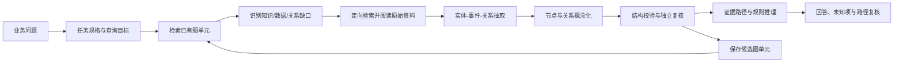

# 循知

从业务问题出发，逐步建立任务级语义模型并进行可验证推理的 agent 原型。输入问题后，agent 检索已有知识和本地资料，抽取实体、事件和有向关系，为节点和关系建立局部概念层，按需补齐知识缺口，再基于证据图和条件规则回答问题。

支持本地网页和命令行。使用 `.env` 中配置的 GLM，通过兼容 Chat Completions 的工具调用接口运行；没有绑定电力领域的固定本体。

建模过程、知识保留原则及具体示例见 [问题驱动的增量语义建模方法](docs/问题驱动的增量语义建模方法.md)。论文方法的适配说明见 [AutoSchemaKG 语义图实现说明](docs/AutoSchemaKG语义图实现说明.md)。

## 启动

需要 Python 3.11+ 和 [uv](https://docs.astral.sh/uv/)。在项目目录执行：

```sh
uv sync --dev
# 将自己的业务资料放入 rawdoc/，或设置 SEMANTIC_DOC_DIR
uv run semantic-agent index
uv run semantic-agent serve
```

打开 **http://127.0.0.1:8765**。索引只需首次建立，资料变更后可在网页“资料与覆盖”中更新。已有索引时可直接启动服务。

`.env` 示例见 [`.env.example`](.env.example)：

```dotenv
GLM_API_URL=https://open.bigmodel.cn/api/paas/v4
GLM_API_KEY=your-key
GLM_MODEL=glm-5.3
GLM_REASONING_EFFORT=high
GLM_API_TIMEOUT_MS=180000
GLM_MAX_OUTPUT_TOKENS=0
```

`GLM_API_URL` 接受 API base URL 或完整 `/chat/completions` 地址。`GLM_API_TIMEOUT_MS=0` 表示不设置读取超时，连接超时仍为 20 秒。修改配置后重启服务。`.env`、索引和运行数据均已加入 `.gitignore`。

## 试跑两轮

第一轮输入：

> 收到直流站日志后，如何判断各系统是否存在异常？请根据姑苏站资料建立最小判断模型，先聚焦运行监盘和控制系统状态，说明已知条件和缺失信息，并保留最多三条有依据的知识。没有实时数据，不要判断当前全站状态。

观察“工作过程”中的检索与阅读记录，然后查看回答的原文引用、“本次局部模型”和“本次知识变化”。局部模型说明每条知识在本轮判断中的作用、知识之间的联系、尚未证实的假设、应用时所需输入及推断边界。在“已积累的知识”中可以展开语义结构、来源摘录和复核理由。

分析过程中，页面实时显示当前阶段、已用时间和检索记录。模型会先逐段输出“回答草稿”，再显示“复核修订中”的内容，完成校验后显示最终答案。等待模型响应时会持续显示阶段和计时；耗时取决于模型接口。停止或异常中断时，已经收到的部分内容会保留，并标注未完成。

浏览器通过 SSE 接收更新，断线后自动续接；刷新页面会恢复当前分析和已生成文字。关闭页面不会取消后台分析，可用“停止”按钮取消。未支持流式响应的兼容接口会回退为完整回复，进度和计时仍可查看。

第二轮输入：

> 请复用已有知识，解释监盘中控制系统主备切换需要核查哪些状态，补充确实缺少的知识，并说明仍不能确定的内容。

观察是否引用同一知识 ID、是否减少重复沉淀，并查看上一轮的局部模型如何帮助组织本轮判断。模型主动决定需要查哪些资料；无法识别或缺少依据的内容列入待确认项。

命令行也可运行：

```sh
uv run semantic-agent ask '你的业务问题' --max-steps 10 --output .semantic/result.json
uv run semantic-agent status
```

## 实际工作流程



采用一个轻量工具调用循环；每个任务最多 10 轮，每轮最多执行 4 个工具调用。没有引入重量级 agent 框架。模型可调用：

| 工具 | 作用 |
|---|---|
| `initialize_task` | 建立目标、范围和初始缺口 |
| `search_knowledge` | 检索已复核的可复用图单元 |
| `search_task_graph` | 在当前任务图中按概念寻找关系候选 |
| `search_sources` / `read_passages` | 按缺口定位并阅读原始证据 |
| `propose_model_update` | 提交实体、事件、事实边、概念映射和规则增量 |
| `infer_model` | 重放规则并生成可核查的证明路径 |
| `submit_model_answer` | 提交引用证据路径的回答和未解决问题 |

任务模型保存实体、事件、概念节点，带上下文和证据的有向事实边，节点/关系到概念的映射，以及带合取前提的条件规则。图关系用于有限深度路径检索；规则证明用于支持异常、状态和约束结论。概念边只用于组织和检索，不会单独成为事实结论。

复核使用**同一 GLM 的独立调用**，检查原文支持、适用范围、过度概括和已知冲突，同时修订回答。只有原文摘录匹配且复核支持的条目进入“模型复核通过”；其余保留为候选。候选、已撤回或来源已过期的知识不会自动复用。复核是模型辅助检查，不等同于领域专家确认。

## 两层知识组织

每次分析都会保存一个 `task_model` 快照，包含任务目标、实体/事件/概念节点、带证据的有向事实边、概念映射、条件规则、开放缺口、图关系路径和规则证明路径。复核通过的事实和规则才进入推理；候选元素仅供查看。跨问题复用时仍按稳定知识 ID重新检查来源、范围和当前缺口。

每条知识联系有自己的方向、说明、范围、条件和原文证据。独立复核同时检查原子知识、整个局部模型和每条联系；单条知识通过，不会自动使组合通过。局部模型或联系没有获得有效复核时，保留为待核查。

“已积累的知识”可切换到“知识之间的联系”。同一联系至少在两个不同问题中通过组合及联系复核，且所有依赖知识和证据仍有效，才可共享复用。重复提交同一规范化问题文本不增加次数。存在明确冲突的联系暂停共享，后续肯定意见不会自动覆盖冲突。知识撤回、来源变化或任一组合前提失效，都会重新计算复用资格。

这个门槛是原型的保守复用策略：两个不同问题不代表两份独立证据，也不等同于专家批准。联系用“端点知识 ID、方向、关系名称、范围、条件”的规范化指纹识别；语义相近但表述不同的联系不会自动合并。共享知识 ID 已实现，术语别名和全局概念统一仍需要进一步建设。

旧分析可查看历史知识引用，但不会自动补造联系或标为组合复核通过。新分析会保存每条知识在各个问题中的用途，可以从知识条目返回这些问题。


## 资料与数据

- 原始业务资料、`.env` 和本地运行数据不提交到 Git。克隆后需自行提供资料和模型配置。
- 默认读取 `rawdoc/`，可用 `SEMANTIC_DOC_DIR` 指定其他目录。当前目录包含多个站点，提问时应说明适用站点。
- 支持 PDF、DOCX、DOC、TXT、CSV、XLSX、XLS 和 Markdown。中文全文检索采用 SQLite FTS5 配合字符二元切分，无需 embedding 服务。
- 默认文档检索排除 TXT/CSV；可通过 `source_type=logs` 或 `all` 搜索这类数据。这个原型把 TXT/CSV 当作日志类资料，其他领域的 CSV 表格也可用 `all` 检索。
- PDF 优先用 `pdftotext`，无此工具时使用 pypdf。扫描页只记录为待 OCR，当前没有自动 OCR 或接线图解析。
- DOCX 保留正文与表格行；图片和合并单元格等复杂含义需核读原件。表格读取保存值，不进行公式重算。
- 旧 DOC 在 macOS 上先用 `textutil`；若提取为空，可配置 `SEMANTIC_SOFFICE_PATH` 指向 LibreOffice，再重建索引。
- 证据定位为 PDF 页码、工作表/行号或提取文本行号；提取行号不代表 Word 页码。
- `.semantic/knowledge.sqlite3` 保存索引、知识、运行记录和工具轨迹。原始资料不会被修改。
- `POST /api/knowledge/clear` 清空全部积累知识、复用关联和共享联系，保留原始资料、索引及局部模型的历史快照；历史页面会标明其知识已清空，不再用于自动复用。运行任务期间拒绝清空，避免正在执行的任务重新写入旧知识。
- 同一数据目录只允许一个网页服务进程，避免重复启动时影响正在运行的分析。
- 文件内容更新或删除后，更新索引会使旧版本证据失效；历史片段继续保留。读取资料和复用知识时也检查文件内容是否在索引后变化。

问题、检索到并读取的片段，以及相关已存知识会发送给 `.env` 配置的 GLM 接口。API 密钥仅由后端读取，不出现在网页或模型提示中。网页只监听 `127.0.0.1`，只支持本机使用。

## 验证与当前边界

```sh
uv run pytest -q
node --check semantic_agent/static/app.js
```

测试覆盖中文检索、来源定位、资料目录边界、错误摘录拦截、来源版本失效、知识去重/撤回、候选升级、回答复核、结构片段保存和本地 API。

流式测试覆盖模型分块响应、工具参数拼接、中文及 Unicode 转义边界、私有推理内容隔离、输出中断、取消、SSE 续接、刷新恢复和知识清空。`semantic_agent/streaming.py` 从普通回复、工具参数及复核 JSON 中提取用户可读内容；公开流中不包含模型的私有推理文本。

此原型用于验证“问题—证据—回答—知识积累”循环。它没有接入实时监盘数据，没有进行专家标注集评测；语义合并主要依赖检索和模型复核，尚不能保证发现所有矛盾或近义重复。完整工业监盘的漏报率、误报率及实时性不在本次验证范围内。

代码入口：`semantic_agent/models.py` 定义局部模型；`organization.py` 维护跨问题引用与共享联系；`semantic_agent/agent.py` 为工具循环与复核；`ingest.py` 为资料解析；`store.py` 为版本、检索和知识持久化；`app.py` 与 `static/` 提供本地界面。
