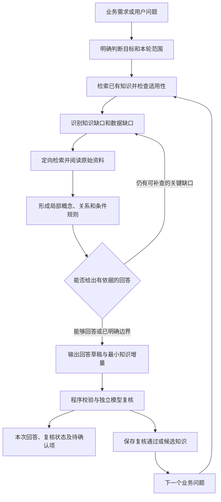

# 问题驱动的增量语义建模方法

本文记录“循知”当前采用的建模方法及其在原型中的实现方式。核心目标是：**从一个业务需求或具体问题出发，在解决问题的过程中识别所需知识，建立有证据约束的局部语义结构，再把值得复用的部分保留下来，供后续问题使用。**

方法适用于持续出现业务问题、资料分散且需要核对依据的场景。下文以换流站监盘问题说明，具体业务规则仍由相应站点的资料和实际数据决定。

## 1. 这里的“建模”指什么

语义建模，是把回答一个问题所需的业务含义明确表达出来，使系统能区分对象、理解关系、识别条件，并说明判断依据。

例如，分析“日志出现系统切换，是否表示设备异常”，需要逐步弄清：日志描述的是哪一个对象；“切换”指什么；切换前后有哪些状态；什么规则约束这次切换；哪些信息仍然缺失。把这些含义和约束表达成有出处的概念、关系与规则，就是这次问题对应的局部模型。

模型的范围随问题展开。概念、关系、状态、规则等都是可选的表达方式，不要求每个问题都填满某几种固定类别，也不按资料目录预先规定整个领域的结构。

### 1.1 建模与预训练的关系

大语言模型已有的知识用于理解问题、提出检索方向和组织解释。站点规则、设备映射、版本差异和具体判据，需要从当前资料中核对。

当前过程不会更新大模型参数，也没有单独训练一个电力模型。新获得的知识保存在外部知识库，下一次处理问题时按需检索。因此，积累的内容可以查看、修改其可用状态、撤回或清空。

资料可以提前建立索引。索引提供的是“到哪里找到这段原文”的能力；业务知识则在实际问题驱动下逐步形成。建立文本索引，不代表已经完成全领域语义建模。

### 1.2 一轮工作的三个产物

| 产物 | 解决的问题 | 主要内容 |
|---|---|---|
| 本次回答 | 当前问题可以回答到什么程度？ | 有引用的结论、推断或建议、适用范围、尚缺的信息 |
| 局部模型 | 这些知识如何共同服务当前判断？ | 共享知识引用、每条知识的作用、联系、假设、输入要求和推断边界 |
| 知识增量 | 哪些内容值得供下一次问题复用？ | 原子知识陈述、条件、证据、局部概念与关系、复核结果 |

这三个产物分别审视。回答可以包含明确标注的设计建议；知识增量需要可核对的依据。本轮也可以只复用已有知识，不新增任何条目。

## 2. 基本原则

1. **由问题决定范围。** 先明确要支持什么判断，再确定需要了解哪些对象和规则。
2. **按缺口获取知识。** 每次检索都服务于某个尚未明确的含义、条件或依据。
3. **保留最小有用结构。** 只表达本次判断需要区分、以后可能复用的含义，避免把资料中的每一个词都建成概念。
4. **证据与适用条件一起保留。** 一条规则必须能追溯到原文，并说明适用站点、系统、版本或时间，以及前提和例外。
5. **允许局部回答和未知。** 资料不足时说明缺口，不能通过补造阈值、别名映射或因果关系使答案看起来完整。
6. **复用时重新判断适用性。** 以前复核通过的知识，仍可能因场景不同、来源变更或解释有误而不适用于当前问题。
7. **通过后续问题持续修正。** 新问题可以补充条件、细化概念或暴露冲突。冲突需要保留证据并核查，不能直接覆盖旧结论。

## 3. 总体过程



这是一个允许回退和补查的过程。表中的阶段用于解释工作方法；当前原型由 agent 在工具调用循环中执行，并非每个阶段都有独立模块或固定表单。

| 阶段 | 主要输入 | 关键工作 | 预期输出 |
|---|---|---|---|
| 明确问题 | 用户需求及上下文 | 确定判断目标、对象、范围和已有输入 | 本轮可处理的问题边界 |
| 查询已有知识 | 问题、知识库 | 查相关知识，检查证据和适用范围 | 可复用条目与不适用之处 |
| 识别缺口 | 判断目标、已知内容 | 区分缺少规则、缺少映射和缺少实际数据 | 检索方向及待补信息 |
| 获取证据 | 短关键词、来源范围 | 检索、阅读全文片段、检查版本 | 带来源定位的原文证据 |
| 建立局部模型 | 已读证据 | 明确必要概念、关系、条件和例外 | 支撑本轮回答的最小结构 |
| 回答与提案 | 局部模型、问题 | 形成回答，筛选值得保留的知识 | 草稿、候选知识、复用清单、未知项 |
| 校验与复核 | 回答、候选、证据 | 检查引用、摘录、范围和语义支持 | 修订回答、逐条复核意见 |
| 保存与复用 | 复核结果 | 去重、保存、管理知识状态 | 可追溯的知识增量 |

## 4. 如何开始处理一个业务问题

### 4.1 先把业务目标收敛到本轮可判断的范围

以问题“收到直流站日志后，如何判断各系统是否存在异常”为例，可以先明确：

| 需要明确的事项 | 在本例中的作用 |
|---|---|
| 用户要分析方法，还是一次实际事件的结论？ | 决定输出判断框架，还是结合具体事件作判断 |
| 本轮涉及哪一站、哪一系统？ | 约束资料检索及规则适用范围 |
| 当前拿到了哪些输入？ | 区分规程、历史日志、当前日志和实时状态 |
| “异常”需要用什么证据判定？ | 找出应查询的状态定义、动作条件及例外 |
| 本轮可以先解决哪个子问题？ | 例如先明确控制系统切换的状态约束 |

如果问题较宽，可以先完成一个有价值的局部问题，再说明后续扩展需要什么。当前没有实际日志或实时状态时，能够形成的是分析方法、局部规则及数据需求，不能据此给出当前全站正常或异常的结论。

这些问题不是每次都要逐项询问用户。能从问题和资料确定的部分直接推进，影响结论且无法确定的部分才需要补充信息。

### 4.2 区分知识缺口与数据缺口

**知识缺口**是“不知道如何解释或判断”，例如不知道 STANDBY 的含义、切换目标的状态约束、某个报文对应什么对象。这类缺口通常需要查规程、说明书或经过核对的既有知识。

**数据缺口**是“知道规则，但不知道这次实际发生了什么”，例如缺少切换前状态、操作记录或同一时段的故障信息。这类缺口需要实际事件数据，继续搜索一般性规程未必能补齐。

两者需要分别记录。否则，agent 容易不断检索资料，却始终无法回答依赖现场输入的问题。

## 5. 按需获取证据并形成局部结构

### 5.1 先查已有知识，再针对缺口补查

查询已有知识时，要检查它回答的是不是同一个问题，以及站点、系统、条件和来源是否适用。即使条目已经复核通过，仍应重新阅读本轮将使用的依据。

在已有知识基础上，把缺口转换成短检索词，例如“控制系统状态”“系统切换”“运行监盘”。检索尽量限定站点和资料类型；目录名提供线索，正文中涉及的对象和站点仍需核对。

规程用于寻找规定和条件；日志用于寻找事件事实。当前原型默认检索文档，分析日志实例时需要显式检索日志类资料。

### 5.2 阅读原文，保留限定条件

检索摘要用于定位线索。形成引用和知识前，需要阅读原始片段，至少弄清：

- 这段话针对什么对象和操作。
- 它规定的是状态含义、必要条件、动作结果，还是一个历史案例。
- 是否有前提、例外、时间限制或不同设备之间的区别。
- 片段是否完整；表格、图片或相邻章节是否影响理解。
- 来源是否仍是当前索引对应的文件版本。

例如，“目标系统必须处于 STANDBY 状态”表达的是一个目标状态约束。即便这个条件满足，也不能直接推导出切换原因已查明、操作一定正确或全站没有异常。

### 5.3 只建立本轮需要的语义结构

可以按问题需要选择以下表达方式，不必每次全部使用：

| 表达方式 | 要明确的含义 | 示例 |
|---|---|---|
| 概念及定义 | 一个术语在当前资料中的含义 | STANDBY 表示什么 |
| 对象之间的关系 | 谁与谁有什么业务联系 | 某规则约束哪类切换目标 |
| 条件规则 | 在什么前提下成立什么约束 | 发生系统切换时，目标状态的要求 |
| 带时间和范围的案例事实 | 某次事件确实发生了什么 | 某历史记录中的操作和状态变化 |

当前原型用 `terms` 表达概念定义，用 `relations` 表达“主语—关系—宾语”，用知识条目的 `statement`、`scope` 和 `conditions` 保留完整语义。

条件不能在转换成关系时丢失。只有“设备—状态—备用”这样的关系，通常不足以表达“发生特定切换时，目标必须满足某状态”的约束。

## 6. 回答问题，并筛选值得保留的知识

回答应说明哪些内容有原文支持，哪些是基于证据的推断，哪些是方法或系统设计建议，以及哪些仍然无法确定。关键事实附上可定位的来源引用。

筛选知识增量时，可以依次判断：

1. 这条内容是否帮助解释当前问题中的对象、关系或判断条件？
2. 它是否可能在后续问题中再次使用？
3. 它能否表达成一条含义明确、范围适当的陈述？
4. 是否有已阅读的原文支持陈述、概念定义和关系？
5. 是否已经存在相同或足够等价的知识，直接复用即可？

得到支持的术语定义、设备关系、状态约束和带条件的规则可以形成知识增量。一次事件事实也可以保留，但要保留其时间和案例范围。

尚未验证的别名映射、根因猜测、任意设定的关联时间窗，以及拟议的软件设计，应留在回答或待确认项中。它们不能仅因为“听起来合理”就作为已知业务规则保存。

**最小增量不等于每轮必须新增一条。** 已有知识足够、证据不足，或者本次只需要整理分析思路时，都可能没有新知识。

## 7. 一条知识如何表达

当前原型的知识提案包含以下字段：

| 字段 | 含义 |
|---|---|
| `kind` | 按当前问题需要命名的类别，例如状态约束；没有固定枚举 |
| `title` | 便于阅读和检索的简短标题 |
| `statement` | 一条完整、可核对的知识陈述 |
| `scope` | 适用站点、系统、来源版本或时间范围 |
| `conditions` | 适用前提、限制和例外 |
| `evidence` | 已读片段 ID 与直接摘录的原文 |
| `model_fragment.terms` | 本条知识所需的概念及定义 |
| `model_fragment.relations` | 本条知识所需的主语、关系、宾语 |

保存时，系统再补充知识 ID、状态、复核意见、产生它的运行记录和时间。来源文件路径、定位及内容版本由证据片段关联获得。

### 7.1 姑苏站原文示例

当前索引中的资料：

- 文件：[规程一：±800kV姑苏换流站运行规程（设备概况）.docx](../rawdoc/姑苏站/运行规程/规程一：±800kV姑苏换流站运行规程（设备概况）.docx)
- 片段：`p_8f5a1af94949a0ab92a47ad4`
- 定位：DOCX 正文，提取行 6955–7002；该定位是提取文本的行号。

其中的原文为：

> 控制系统为完全双重化的冗余系统，其中只能有一个系统是ACTIVE状态。发生系统切换时，只能切换至正处于STANDBY状态的系统，不能切换至处于其他状态的系统。

同一片段的状态表将 STANDBY 标为“备用”，说明为：

> 时刻跟随ACTIVE系统的运行状态，随时准备切换系统

如果当前问题需要解释切换目标状态，可以据此提出以下知识增量。这个 JSON 展示提案格式，其保存状态需要经过本轮实际校验和复核确定。

```json
{
  "kind": "状态约束",
  "title": "控制系统切换目标须处于 STANDBY 状态",
  "statement": "姑苏站控制系统发生系统切换时，只能切换至当时处于 STANDBY 状态的系统，不能切换至其他状态的系统。",
  "scope": "姑苏站控制系统；来源为《规程一：±800kV姑苏换流站运行规程（设备概况）》的控制保护系统状态及切换相关内容",
  "conditions": [
    "发生控制系统切换时"
  ],
  "evidence": [
    {
      "passage_id": "p_8f5a1af94949a0ab92a47ad4",
      "quote": "发生系统切换时，只能切换至正处于STANDBY状态的系统，不能切换至处于其他状态的系统。"
    },
    {
      "passage_id": "p_8f5a1af94949a0ab92a47ad4",
      "quote": "时刻跟随ACTIVE系统的运行状态，随时准备切换系统"
    }
  ],
  "model_fragment": {
    "terms": [
      {
        "name": "STANDBY",
        "definition": "控制系统的备用状态：时刻跟随 ACTIVE 系统的运行状态，随时准备切换系统。"
      }
    ],
    "relations": [
      {
        "subject": "控制系统切换的目标系统",
        "predicate": "切换时必须处于",
        "object": "STANDBY 状态"
      }
    ]
  }
}
```

这条知识回答了“切换目标应满足什么状态条件”。实际判断某次切换是否异常，还需要该次事件的对象、状态和相关记录；它本身不包含实际事件结论。

### 7.2 把知识组织成本次问题的局部模型

每次提交还必须包含 `local_model`。它不复制出一套独立知识库，而是引用共享知识 ID，并记录这些知识在本次判断中的用途。

| 字段 | 作用 |
|---|---|
| `objective`、`scope` | 明确本轮要支持的判断及适用范围 |
| `knowledge_uses` | 用 `ref` 引用知识，用 `role` 说明其判断作用 |
| `links` | 连接两条知识，保留方向、业务关系、说明、适用范围、条件和原文证据 |
| `assumptions` | 尚未证实的假设，不作为已知事实 |
| `required_inputs` | 将这个局部模型用于具体事件时还需要什么输入 |
| `boundaries` | 即使已有知识都成立，仍不能直接得出的结论 |

`knowledge_uses` 必须恰好覆盖本次新增及声明复用的知识。新增知识用 `new:0`、`new:1` 等零基序号；已有知识用本轮已检索的 `k_...`。保存时，临时引用会转换为稳定的知识 ID。

以上例为基础，如果分别保存了 STANDBY 定义和切换约束，就可以提出“状态定义解释切换约束中的术语”这一有向联系。定义在本次判断中的作用是澄清状态含义，约束的作用是提供必要条件；模型边界则应保留“满足必要条件不能证明整次切换正常”。联系需要另外提交证据并复核，不能仅凭两条知识共同被使用就生成。

## 8. 校验、复核与保存

### 8.1 程序校验

当前原型会检查提交结构，以及回答中引用的片段是否在本轮实际读取、声明复用的知识 ID 是否在本轮实际检索。提交答案至少需要一个本轮已读片段的引用。

对候选知识，还会检查证据片段是否已读取、摘录是否能在原文中匹配。匹配时会忽略空白并统一字母大小写，因此这是规范化后的文本匹配。保存前再次检查原文件是否仍可用、内容版本是否变化。

这些检查能发现伪造引用、错误摘录或来源变化，不能单独证明陈述在语义上得到证据支持。知识证据校验失败的条目可以保留为候选，并附带错误原因，但不会因此获得自动复用资格。

### 8.2 独立模型复核

原型使用同一 GLM 的另一次调用，向它提供回答、候选知识、已读来源及检索到的相关既有知识。复核重点包括：

- 原文是否支持完整陈述，以及其中的概念定义和关系。
- 前提、例外和适用范围是否完整。
- 是否混淆报告来源与被报告对象、信号出现与实际动作。
- 是否将历史案例泛化为通用规则，或把必要条件当成充分条件。
- 是否混用了站点和版本，或与提供的已有知识存在冲突。
- 回答中的事实、建议和未知是否区分清楚，引用是否正确。

复核对每个候选给出 `supported`、`insufficient` 或 `conflict` 及理由，同时返回复核或修订后的完整答案。

“独立”指另一次调用及单独的复核任务。它仍可能与前一次生成具有相同盲点，不等同于专家确认。

### 8.3 知识状态与回答状态分别管理

| 知识状态或条件 | 保存和复用方式 |
|---|---|
| `reviewed`：模型复核通过 | 对新条目，要求摘录和来源检查通过，且复核为 `supported`；复用时还要检查来源和适用性 |
| `candidate`：候选 | 包括证据不足、存在冲突、摘录检查失败或复核未完成等情况；不自动复用 |
| `withdrawn`：已撤回 | 保留记录，不自动复用；手动恢复后为候选 |
| 来源已失效 | 属于来源可用性条件；即使条目原来复核通过，也不自动复用 |

局部模型另有整体复核意见 `model_review`，每条联系另有 `link_reviews`。整体复核检查各条知识的用途及其组合是否适用于本轮目标，联系复核检查两端之间所声称的业务关系。单条知识分别通过，不会自动批准组合；任一联系未通过，局部模型保持待核查。

回答也有“已复核”和“待核读”的状态。回答是否获得有效修订，与每条知识是否得到支持分别记录，不能只看任务是否显示“已完成”就认为全部结论都已复核。

若整个模型复核调用失败，当前新增知识仅保存为候选，回答保留为待核读草稿。

## 9. 如何在后续问题中继续积累

下一次问题到来时，agent 从知识库检索相关条目，检查原文和适用条件，并决定：直接复用、针对缺口补查，或者提出冲突和待确认事项。上一轮的历史对话不会自动整体注入下一轮；跨问题复用主要通过显式保存的知识条目发生。

例如，第一轮保留了“系统切换目标须处于 STANDBY”的规则，第二轮询问“看到系统切换是否一定发生故障”，就可以复用该条知识中的状态约束，同时继续寻找切换触发方式的依据。新的问题决定下一步需要补充什么，而不是触发一次全资料重新建模。

当前实现有以下具体行为：

- 根据规范化后的陈述、适用范围和条件生成指纹，避免同一知识重复保存。
- 同一指纹的候选知识经过新的有效复核后，可以升级为复核通过。
- 已撤回知识不会因为后续出现相同提案而自动恢复。
- 已经存在的复核通过条目不会被普通重复提案直接覆盖。
- 资料更新或删除后，更新索引会使旧来源失效；读取与复用时也检查原文件是否变化。
- 清空知识时删除积累条目和语义结构，保留资料、索引与标明历史属性的分析记录。

### 9.1 从局部联系逐步形成共享联系

一条联系至少在两个不同问题中通过局部模型整体复核和联系复核，且相关运行完成、知识与来源仍有效，才进入共享复用。相同规范化问题文本的重复运行只算一个问题。共同引用次数、候选知识数量和单条知识通过次数，都不能替代这项组合复核。

同一联系按两端知识 ID、方向、关系名称、适用范围及条件的规范化指纹识别。不同范围、不同条件或反向联系分别保留。已有明确冲突的联系暂停共享，不能用后来更多肯定复核覆盖；冲突材料需要进一步核查。

这是原型的保守门槛，不能理解为统计置信度或独立证据数量。相近表述尚不会自动合并，问题文本不同也不意味着业务场景必然独立。

每次查询都会根据当前知识状态和来源重新计算复用资格。任一组合前提被撤回或失效，会使该次验证不再贡献共享资格，即使失效的前提不是这条联系的两个端点。清空知识后，历史局部模型仅保留可回看的快照，不再参与自动复用。

旧分析记录会呈现已保存的知识引用，不自动追溯生成业务联系，也不授予整体复核状态。新的分析能够从知识条目查看它被哪些问题使用、分别承担什么作用。

这里的去重以文本指纹为主。近义概念统一、别名消歧、跨条目冲突发现、知识拆分和合并，目前仍主要依赖模型判断及后续人工核查，没有完整的自动维护机制。

## 10. 过程如何向用户反馈

建模过程需要让用户知道当前在做什么、已经获得什么，以及哪些内容还未确认。当前界面依次呈现检索进展、流式回答草稿、复核中的修订内容和最终结果，并持续显示当前阶段与耗时。

| 展示阶段 | 用户可以如何理解 |
|---|---|
| 查找依据 | agent 正在检索或阅读，尚未形成完整结论 |
| 草稿生成中 | 可以提前阅读回答，但引用、表达及知识提案仍需检查 |
| 复核修订中 | 正在输出根据证据复核的文本，尚未结束 |
| 已复核或待核读 | 根据实际复核结果判断答案成熟度，并查看未知项及知识状态 |
| 取消或异常中断 | 已收到的部分内容仍可查看，但不能视为完整结果 |

页面断线后自动续接，刷新后恢复当前分析和已生成内容。公开反馈包括工作进展、证据记录及回答，不展示模型的私有推理文本。

## 11. 当前原型如何执行，以及尚未实现什么

原型采用单个 agent 的工具调用循环，再增加一次模型复核调用。模型按当前上下文选择检索、阅读或提交；程序负责工具执行、校验、存储和过程反馈。

| 工具 | 方法中的作用 |
|---|---|
| `search_knowledge` | 寻找可复用的既有知识 |
| `search_sources` | 针对缺口检索资料 |
| `read_passages` | 阅读可定位的原文并检查来源 |
| `submit_result` | 提交答案、候选增量、复用 ID 和待确认问题 |

“先查已有知识”“按缺口补查”等行为主要通过提示词引导；判断目标、知识用途、联系及边界以 `local_model` 显式保存。程序强制检查引用完整性、端点有效性、摘录、复核状态及文件版本，但仍没有覆盖全部规划阶段的状态机或自动跟进缺口的机制。

一轮默认最多调用模型 10 次，每轮最多执行 4 个工具调用，并提示在最后一轮提交结果。这个上限用于控制执行范围，不能保证每次都得到完整答案。如果没有形成满足引用要求的提交，运行会以未完成结束。

当前能够验证的是“问题—证据—局部模型—回答—知识增量—后续复用”的循环。以下能力仍需后续建设：

- 自动执行的复杂规则、时序关联和实时监盘异常检测。
- 全局统一的概念标识、别名映射、完整本体推理和图谱查询。
- 全库级别的冲突检测，以及系统性的知识修订和依赖传播。
- 待确认事项的自动跟进，以及主动向业务人员发起澄清的完整流程。
- 扫描件 OCR、复杂图纸理解及图像证据校验。
- 专家批准流程和面向具体业务的准确率、漏报率、误报率评测。

原型的数据结构允许按问题形成不同类别的知识；当前提示词仍包含换流站日志分析的具体约束。迁移到其他业务时，需要核对并调整这些约束。

## 12. 如何判断这个方法是否有效

知识数量增长可以反映使用量，却不足以说明建模质量。评估应围绕连续的真实业务问题展开，重点观察：

| 观察维度 | 要回答的问题 |
|---|---|
| 当前回答的可用性 | 是否解决了本轮能解决的部分，并明确了边界？ |
| 证据可核对性 | 关键事实是否能定位到真正支持它的原文？ |
| 结构必要性 | 保留的概念、关系和条件是否帮助区分了业务含义？ |
| 后续复用价值 | 下一个问题能否正确使用这些知识，并减少重复提取？ |
| 增量质量 | 是否重复保存、过度泛化或遗漏适用条件？ |
| 修正能力 | 来源变化、撤回或新证据出现后，能否避免继续错误复用？ |
| 过程透明度 | 用户能否区分正在生成、已复核、候选和未知？ |

这些是方法的评估方向，当前原型没有自动生成上述指标。实践中可以选择一组连续问题，逐轮记录答案质量、证据支持、知识增量和复用情况，再由业务人员核查。

## 13. 对应代码

| 文件 | 对应职责 |
|---|---|
| [agent.py](../semantic_agent/agent.py) | 提示词、工具循环、知识提案、证据校验及模型复核 |
| [models.py](../semantic_agent/models.py) | 局部模型、知识引用及联系的数据结构和引用校验 |
| [organization.py](../semantic_agent/organization.py) | 跨问题引用、局部模型快照、共享联系和依赖失效 |
| [store.py](../semantic_agent/store.py) | 资料索引、知识检索、去重、状态及运行记录 |
| [ingest.py](../semantic_agent/ingest.py) | 原始资料提取、切分及来源版本管理 |
| [llm.py](../semantic_agent/llm.py) | GLM 调用和流式响应处理 |
| [streaming.py](../semantic_agent/streaming.py) | 从模型输出中提取用户可见的进展和回答 |
| [app.py](../semantic_agent/app.py) | 任务管理、接口及事件推送 |
| [static/app.js](../semantic_agent/static/app.js) | 页面反馈、回答展示及证据查看 |

启动与操作说明见 [README](../README.md)。
